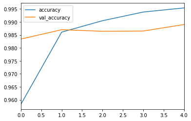
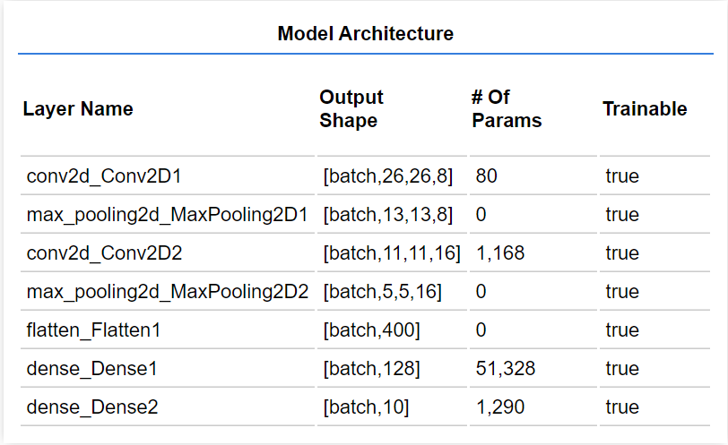
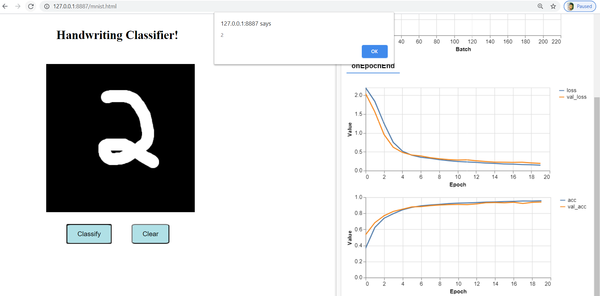
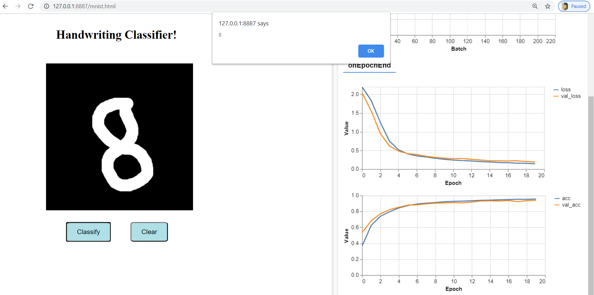
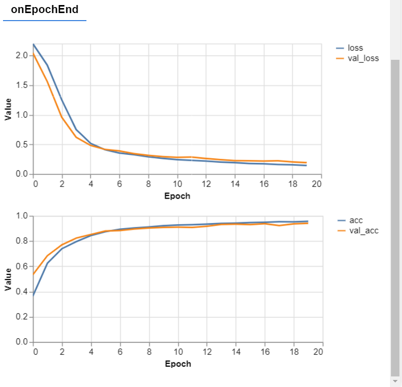

# Digit Recognition

## Getting started
- Clone this repository `https://github.com/bharathikannan1311/digit-recognition` 

## Implementations

1. `Neural Network from Scratch` - for better understanding of how neural network works.
2. `Tensorflow` - the same problem solved using tensorflow.
3. `Tensorflowjs` - Classifying digits in the browser.
4. `Tensorflowjs - Webcam` - Classifying the sign from the webcam in the browser.

## 1. Neural Network from scratch

- A simple implementation of `Neural Network from scratch` in python. It does not use any Deeplearning library like tensorflow and all of the functions are implemented from scratch only using numpy `for better understanding of concepts and how Neural Networks work`.

- It will be much slower when compared to the same problem solved using tensorflow because we can use much better optimization techniques. This code can be used for learning purposes.

- Here we will be using MNIST dataset for digit recognition.

- `Prerequisites`
    - [Numpy](https://numpy.org/) - Numerical scientific computing library.
    - [Matplotlib](https://matplotlib.org/) - Plotting library.
    - [Python-mnist](https://pypi.org/project/python-mnist/) - for loading mnist dataset
    - [MNIST Dataset](http://yann.lecun.com/exdb/mnist/) - Dataset for Digit Recognition
        - Create MNIST directory and download the dataset and store it in this directory.

This code is not as efficient and takes long time to converge and the same problem solved through tensorflow will be much efficient and we can use better optimization techniques and Convolutional Neural Networks are suitable for Image Datasets.

## 2. Tensorflow Implementation.
- The same problem implemented in tensorflow with Convolutional Neural Networks and adam optimizer.

- `Prerequisites`
    - [Tensorflow](https://www.tensorflow.org/) - Deeplearning library.

- It's accuracy on the mnist test set is about `98.9%`.
### Accuracy Plot

## Tensorflowjs
- Implemented using Tensorflowjs library.
- It trains the model in the browser when launched in the browser and then classifies the digit that we draw in the browser.

### Model Architecture

 

### Perdictions

 

#### Loss and Accuracy

## Tensorflowjs - Webcam

- We need to train the model in the browser by taking input pictures from the webcam as training data.
- Then we can use our model to classify for new inputs.

Video demo - [link](https://github.com/bharathikannan1311/digit-recognition/blob/master/Tensorflowjs%20-%20Webcam/Demo/demo.mp4) 

